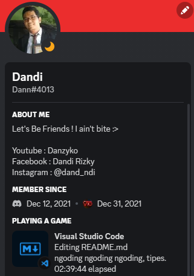
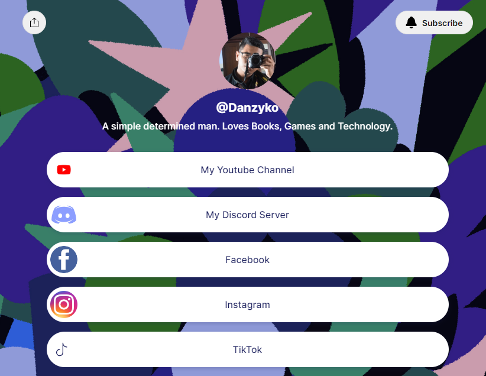

# <p align = "center">Hello Amazing People ~ 
> This is an assignment for "My Profile." 
---
## <p align = "center">😉 My Bio
---

<p align="center"> </p>

Hello ! 
<p>I'm Dandi Rizky Eko Saputro, you can call me Dandi. Currently I'm learning Software Engineering at RevoU. 

-----
## <p align = "center"> 📫 Connect With Me  
-----
- Facebook : [Dandi Rizky Eko Saputro](https://www.facebook.com/dandirizkyy94/)


- Instagram : [@dand_ndi](https://www.instagram.com/dand_ndi/?hl=id)


- YouTube : [Danzyko](https://www.youtube.com/@Danzyko/about)\


- Discord : [Dann#4013](https://discord.gg/u838aV7m2E)

<p align = "center">


- Linktree : [link.tree/Danzyko](https://linktr.ee/Danzyko?fbclid=IwAR1lXNo3tazSDnpp9comVpR_2bT0GcANjvOfU1PFdTBi5qZkrdgw0jLNs6M)


- LinkedIn : [Dandi Rizky](https://www.linkedin.com/in/dandirizkyy/)


- Github : [DandiRizkyy](https://github.com/DandiRizkyy)


---
## <p align = "center">🎬 Some of My Youtube Videos
---

[<p align = "center">](https://www.youtube.com/watch?v=XMTjWsN4OfI)

[<p align = "center">](https://youtu.be/ULYp-qjuM6w)

[<p align = "center">](https://youtu.be/1Cbu7IhZxys)

---
## <p align ="center">💼 My Technical Skills
---
1. Code Editor and Visual Studio Code <p>

2. Git / Github <p>

3. Terminal / CLI <p>

4. C <p>

5. HTML <p>

6. CSS <p>

7. JavaScript <p>

8. TypeScript <p>

9. Python <p>

10. Adobe Photoshop <p>

11. Adobe Premiere <p>
---
## <p align = "center">🚩 My Favorite Websites
---

| Name | URL | Reason |
|:--------:|:---------:|:-------:|
|Youtube  | <https://www.youtube.com/>    | best place to chill wacthing videos |
|Google   | <https://www.google.com/>  | the source of information |
|Facebook | <https://www.facebook.com/> | best place to find new memes  |
|Discord | <https://discord.com/> | best place to talk with friends   |

----
## <p align = "center">💻 My Code Examples
----
### Markdown
```markdown
# Hello World !
This is a paragraph.
```
### HTML
```html
<div class="main">
    <h1>Hello !</h1>
    <p>This is paragraph.</p>
</div>
```
### C
```c
#include <stdio.h>

int main(void)
{
    printf("Hello, world!\n");
}
```
### CSS
```css
h1 {
    color: blueviolet;
    text-align: center;
}
```
### JavaScript
```js
const text = "Hello, world";
console.log(text);
```
### TypeScript
```js
const text: string = "Hello, World";
console.log(text);
```
### Python
```python
print("Hello, world!")
```
